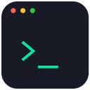

# CLI Companion

<p align="center">
  
</p>

<p align="center">
  <a href="https://github.com/w2018/CLI-Companion/actions/workflows/ci.yml"></a>
  <a href="https://github.com/w2018/CLI-Companion/releases/latest"></a>
  <a href="LICENSE"></a>
</p>

**CLI 应用辅助** —— Windows 桌面 CLI 服务管家。将多个命令行服务（`java -jar`、`python app.py`、`node server.js`、`nginx.exe`…）集中托管：可视化配置参数、启动/停止/重启、实时日志、崩溃自动恢复、跨设备配置同步。

> 关闭 GUI，服务继续常驻运行；重新打开，状态自动恢复。

## 功能特性

- 🗂️ **服务管理**：新建/编辑/删除/启动/停止/重启，参数有序编辑（选项/开关/位置参数），环境变量（机密标记）
- 🖥️ **窗口语义**：无窗口 / 新控制台（可见·隐藏）三种控制台模式，按服务独立配置
- 🛡️ **进程可靠性**：Windows Job Object 管理进程树，停止不留孤儿进程；崩溃自动重启（指数退避 + 10 分钟熔断）
- ⚡ **事件驱动刷新**：daemon 实时推送服务/配置/同步事件（`event.subscribe` 长连接），崩溃与自动重启即时提醒，告别高频轮询
- 💾 **配置导入导出**：一键导出/导入 JSON 配置备份，跨机器迁移无需手动拷贝
- 📜 **日志**：每服务独立日志，实时查看、10MB 轮转归档、一键清理日志内容
- 🔁 **双进程架构**：daemon 常驻托管服务，GUI 随开随关；GUI 启动自动拉起 daemon
- ☁️ **WebDAV 配置同步**：多设备协作，双向修改自动检测、本地优先（LWW）+ 冲突文件；凭据 DPAPI 加密存储
- ⚙️ **Win32 服务模式**：`--install-service` 一键注册系统服务，开机自启、无人值守
- 📦 **便携模式**：`--portable` 数据目录跟随 exe（写入 portable.marker），U 盘即插即用
- 🖥️ **系统托盘**：关闭最小化到托盘、退出方式可选（仅退出 GUI / 完全退出并停止服务）
- 🚀 **单实例**：重复启动自动唤起已有窗口

## 架构

```
┌──────────────┐   命名管道 + JSON-RPC   ┌─────────────────┐
│  GUI (Tauri) │ ──────────────────────▶ │ daemon (Rust)   │
│  React 前端  │ ◀────────────────────── │ 服务编排/配置/同步│
└──────────────┘      4字节长度帧协议      └────────┬────────┘
                                                    │ CreateProcess + Job Object
                                           ┌────────▼────────┐
                                           │   受管 CLI 服务   │
                                           └─────────────────┘
```

- **技术栈**：Rust（tokio）+ Tauri 2 + React 18 + TypeScript + TanStack Query + Zustand + Zod + Tailwind CSS
- **协议**：命名管道 `\\.\pipe\cli-companion-daemon`，4 字节小端长度前缀 + JSON（单帧上限 4MB）
- **Workspace**：`protocol`（RPC 协议）/ `domain`（领域模型与配置迁移）/ `platform-windows`（Job/DPAPI/锁）/ `daemon`（服务编排）/ `webdav-client`（同步）/ `gui-core`（Tauri 桥接）

## 构建与开发

环境要求：Rust 1.77+、Node.js 20+、Tauri 2 依赖（Windows: MSVC + WebView2）。

```bash
# 安装前端依赖
npm install

# 开发模式（两个终端）
cargo run -p cli-companion-daemon -- --data-dir <目录>   # 终端1：daemon
npm run tauri dev                                        # 终端2：GUI

# 测试
cargo test --workspace    # Rust 单元 + 集成测试
npm test                  # 前端契约测试
npm run typecheck         # TypeScript 检查

# 构建安装包（NSIS，产物在 target/release/bundle/nsis/）
cargo build --release -p cli-companion-daemon
npm run tauri build
```

## 安装与使用

1. 下载 [Releases](https://github.com/w2018/CLI-Companion/releases) 中的 `CLI Companion_x.x.x_x64-setup.exe` 安装（推送 `v*` 标签后由 CI 自动编译上传）
2. 启动 GUI（自动拉起 daemon），在「服务管理」添加第一个 CLI 服务
3. 可选：设置页开启「开机自动启动」；或以管理员运行 `cli-companion-daemon.exe --install-service` 注册系统服务

数据目录：`%LOCALAPPDATA%\CLICompanion`（`config/` 配置、`logs/` 日志、`data/` 运行时状态、`cli/` 受管二进制应用）。

便携模式（免安装、U 盘即插即用）：在 GUI 同目录运行 `cli-companion-daemon.exe --portable`，或手动放置 `portable.marker` 文件——数据目录即 exe 所在目录，GUI 与 daemon 共用。

## CI / CD

| 工作流 | 触发 | 内容 |
|--------|------|------|
| [CI](.github/workflows/ci.yml) | push / PR | cargo fmt + clippy（`-D warnings`）+ Rust 全量测试 + 前端 typecheck/test/build |
| [Release](.github/workflows/release.yml) | 推送 `v*` 标签 | 同上检查 → 编译 daemon (release) → `tauri build` 生成 NSIS 安装包 → 自动上传到该标签的 GitHub Releases |

发布流程：更新三处版本号（`Cargo.toml` / `package.json` / `src-tauri/tauri.conf.json`）→ 提交 → `git tag v1.3.0 && git push origin main --tags` → CI 产出安装包并挂到 Releases。

## 安全

- 机密（WebDAV 密码）经 **Windows DPAPI** 加密存储于本机，不参与同步、不写入日志
- RPC 未知方法拒绝、单帧上限 4MB、配置未知字段拒绝、原子写入 + 损坏自动恢复
- WebDAV 建议使用应用专用密码（如坚果云「应用密码」）

## 许可证

[MIT](LICENSE) © 曾先生
